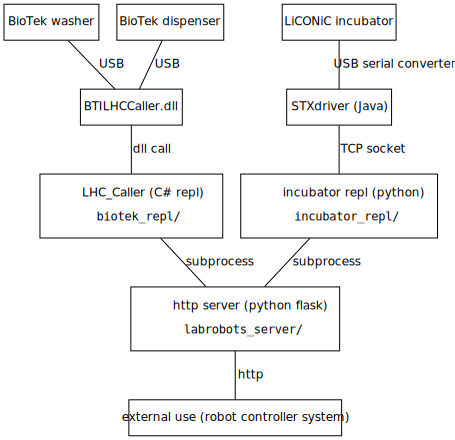

# imx-pharmbio-automation

Control of the PreciseFlex (PF) robotarm and the MolDev ImageXpress (IMX) microscope.

A scheduler repeatedly talks to the PF and the IMX to keep them busy.

A human operator can add entries to the scheduler.



### IP numbers

ip           | computer
---          | ---
`10.10.0.99` | IMX Windows computer
`10.10.0.98` | PreciseFlex robotarm
`10.10.0.97` | "GBG" Windows computer
`10.10.0.55` | robotlab ubuntu nuc

## IMX notes

These are in the readme for the imx-server: imx-server/README.md

## PreciseFlex notes

The webpage with documentation is at http://preciseautomation.com/ but behind a password,
so I put a copy on the nfs under `/share/data/manuals_and_software/preciseflex`.

The robotarm can be communicated with on telnet. Install rlwrap and netcat and run:

```sh
rlwrap nc 10.10.0.98 23
```

The password is `Help` (the default). The supported commands are documented under
_Controller Software/Software Reference/Console Command Summary_.

The robotarm has an ftp server. The flash script outlined below uses the python FTP library for it.
Another easy way to inspect is to mount it using curlftpfs:

```sh
mkdir -p flash
curlftpfs 10.10.0.98 flash
```

The robotarm has a web server for configuring it. You can forward it to localhost:1280 with:

```sh
ssh -N -L 1280:10.10.0.98:80 robotlab-ubuntu
```

The robotarm IP can be changed there (we have done this to put it on our local network),
see _Control Panels/Communication/Network_. There is also a virtual pendant.

The robotarm programming language is a dialect of VisualBasic.
It is called _Guidance Programming Language_ (GDS).
We use a TCP server written in GDS by PreciseAutomation called Tcp_cmd_server,
or TCS for short, with some small modifications to control the arm.
Using the telnet method is too brittle.

TCS is at port 10000 for querying and 10100 for motion related commands.

### Flashing the PreciseFlex

We flash our modified version of Tcp command server (TCS) from
./Tcp_cmd_server/ to the robot arm using FTP and the telnet port 23.
Because the telnet port is so brittle (it sometimes gets stuck and you have
to power off and on the robotarm to get it back) we keep one connection open
by following the tail of a fifo.

Run `python flash.py` and follow the instructions:

```sh
dan@NUC-robotlab:~/imx-pharmbio-automation/pf_repl$ python flash.py

        Using pf23.fifo as fifo. If the fifo is not connected then run:

            tail -f pf23.fifo | nc 10.10.0.98 23

        When done you can send quit and then close nc:

            >>pf23.fifo echo quit

        The rest of this program outputs commands corresponding to its communication on the fifo.

>>pf23.fifo echo Help # this is the default password
```

Concurrently, we run nc in another terminal as per the instructions:

```sh
dan@NUC-robotlab:~/imx-pharmbio-automation/pf_repl$ tail -f pf23.fifo | nc 10.10.0.98 23


Welcome to the GPL Console

Password:

GPL: stop -all
GPL: unload -all
GPL: execute File.CreateDirectory("/flash/projects/Tcp_cmd_server")
*Interlocked for read*
GPL: load /flash/projects/Tcp_cmd_server -compile
01-31-2022 04:07:40: project Tcp_cmd_server, begin compiler pass 1
01-31-2022 04:07:40: project Tcp_cmd_server, begin compiler pass 2
01-31-2022 04:07:40: project Tcp_cmd_server, begin compiler pass 3
Compile successful
GPL: execute StartMain()
GPL:
```

The first terminal has now finished with:
```sh
>>pf23.fifo echo 'stop -all'
>>pf23.fifo echo 'unload -all'
>>pf23.fifo echo 'execute File.CreateDirectory("/flash/projects/Tcp_cmd_server")'
# ftp_store: Cmd.gpl
# ftp_store: Tcs.gpo
# ftp_store: Functions.gpl
# ftp_store: Load_save.gpl
# ftp_store: Class_StringList.gpl
# ftp_store: Class_station.gpl
# ftp_store: Globals.gpl
# ftp_store: Class_command.gpl
# ftp_store: Main.gpl
# ftp_store: Class_vector3.gpl
# ftp_store: Pharmbio.gpl
# ftp_store: Class_gpofile.gpl
# ftp_store: Project.gpr
# ftp_store: Startup.gpl
# ftp_store: Custom.gpl
>>pf23.fifo echo 'load /flash/projects/Tcp_cmd_server -compile'
>>pf23.fifo echo 'execute StartMain()'
```

You should now be able to use the Tcp_cmd_server (TCS) on the robotarm's port 10100 and 10000!

### Tcp_cmd_server (TCS), modified

These commands are added:

```
' Cmd_WhereJson -- Gets the robot positions in json
' Cmd_MoveJ_NoGripper -- Move to a location defined by angles, excluding the gripper joint (5)
' Cmd_MoveGripper -- Move the gripper joint (5)
' Cmd_MoveJ_Rel -- Move joints relative
' Cmd_MoveC_Rel -- Move cartesian relative
```

Try them on port 10.10.0.98:10100, but first put verbose, power on, attach and home:

```sh
rlwrap nc 10.10.0.98 10100
```
```
mode 1
hp 1
attach 1
home
MoveJ_Rel 1 0 0 0 0 -10
MoveC_Rel 1 10 0 0 0 0 0
```

See the documentation pdf Tcp_cmd_server/TCS_Users_Guide_3.0C1.pdf for more info.

