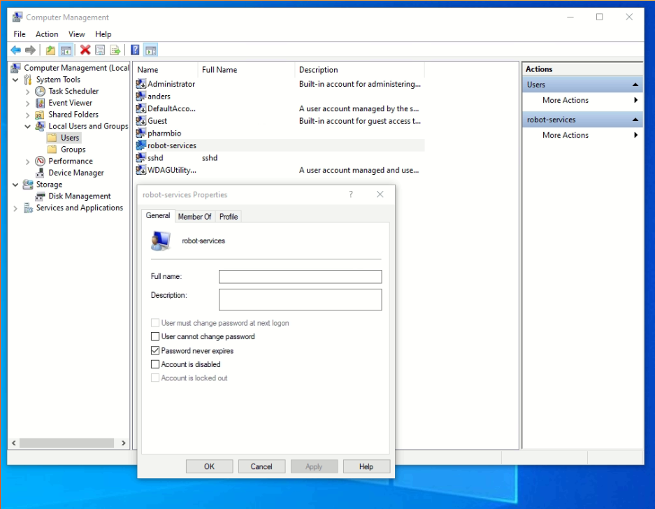

# biotek-server

Installation instructions for the BioTek server for controlling the washer and dispenser.
The server is a python flask server which calls the biotek cli executable
as a subprocess, which in turn communicates with the BioTek instruments.

</img>
<br><br>
</img>

## Requirements

Install Python >= 3.7 on Windows. Don't use the App-Store Python, use the installer.
Tick "Add Env variables" for all users in the setup program. This makes sure running as Service will work.

The instructions assume you use PowerShell. In PowerShell check what python you are using with `Get-Command python`.
Make sure you have virtualenv installed run `python -m venv`. The output should resemble this:

```
PS C:\pharmbio\robotlab-labrobots> Get-Command python

CommandType     Name           Version        Source
-----------     ----           -------        ------
Application     python.exe     3.7.515...     C:\Program Files\Python37\python.exe


PS C:\pharmbio\robotlab-labrobots> python -m venv --help
usage: venv [-h] [--system-site-packages] [--symlinks | --copies] [--clear]
            [--upgrade] [--without-pip] [--prompt PROMPT]
            ENV_DIR [ENV_DIR ...]

Creates virtual Python environments in one or more target directories.
```

## Installation

Use Windows PowerShell. Clone the git repo to the directory `C:\pharmbio\robotlab-labrobots`.

```
cd C:\pharmbio\robotlab-labrobots\biotek-server

python -m venv venv

.\venv\Scripts\Activate.ps1

# install flask
pip install -r requirements.txt
```

## Development test

You can now test the installation by starting the web server "manually".
Further down in the documentation are instructions how to setup autostart of the server.

```
# make sure virtualenv is activated
.\venv\Scripts\Activate.ps1

# start server
python cliwrapper.py

# by default it runs on 10.10.0.56:5050, but this can be overriden:
$env:HOST = '0.0.0.0'; python cliwrapper.py
$env:PORT = '13337'; python cliwrapper.py
```

In another terminal you can now curl to it.

```
# try the test endpoint `help`, which writes windows help pages to you
curl.exe 'http://10.10.0.56:5050/help/ren'

# execute test communication on washer
curl 'http://10.10.0.56:5000/wash/LHC_TestCommunications/'

# execute test program on washer
# make sure you have a plate in washer and D bottle with something like destilled water or PBS
curl 'http://10.10.0.56:5000/wash/LHC_RunProtocol/automation/2_4_6_W-3X_FinalAspirate_test.LHC
```

Note that you cannot curl to `localhost` unless you change the HOST env var to `127.0.0.1` or `0.0.0.0`.

Example output from the `help` test endpoint, using devserver as jumphost:

```
$ ssh devserver curl 10.10.0.56:5050/help/ren 2>/dev/null | jq --raw-output .out
Renames a file or files.

RENAME [drive:][path]filename1 filename2.
REN [drive:][path]filename1 filename2.

Note that you cannot specify a new drive or path for your destination file.
```

## Configure BioTek software

Make sure that this option is checked in each protocol:


This can be found by going to Tools > Preferences in LHC. If the other option
is checked, the program may have difficulty switching between instruments.
The error message you would get is:

> Test Communications error. Error code: 6061 Port is no longer available.

## Configure user for autostarting

Because of dialog boxes in BioTek `BTILHCRunner.dll` that are used by the
`LHC_CallerCLI.exe` the Washer and Dispenser Rest-servers can not run as
"Services" in Windows, they will render error if not running as Desktop app
on a logged in user.

The error is:

> Message - Showing a modal dialog box or form when the application is not
> running in UserInteractive mode is not a valid operation

We workaround this by running the REST-servers as programs on a logged in user.

- To allow more than one user on remote desktop at same time on Windows 10
  we are using this mod: https://github.com/stascorp/rdpwrap

- Use the _autologon_ app to enable logging in on Windows:

  

- Set never expire on windows password. Start _Computer Management_, under System Tools > Local Users and Groups > Users, check "Password never expires" under the user's properties:

  

- Configure Windows Defender Firewall to allow incoming traffic to python on either all ports or 5050.

  

- Add ScheduledTasks. Important: start PowerShell as Administrator, otherwise you will get `ERROR: Access is denied.`
-
    ```
    # Create user robot-services
    net user robot-services <password-here> /add
    net localgroup administrators robot-services /add
    ```

    The output of `net user robot-services` should now resemble this:

    ```
    PS C:\pharmbio\robotlab-labrobots> net user robot-services
    User name robot-services
    Full Name
    Comment
    User’s comment
    Country/region code 000 (System Default)
    Account active Yes
    Account expires Never

    Password last set 2021-08-25 13:27:15
    Password expires Never
    Password changeable 2021-08-25 13:27:15
    Password required Yes
    User may change password Yes

    Workstations allowed All
    Logon script
    User profile
    Home directory
    Last logon 2021-08-25 15:44:45

    Logon hours allowed All

    Local Group Memberships *Administrators *Users
    Global Group memberships *None
    The command completed successfully.
    ```

    - The desktop for this user is automatically locked via a ScheduledTask being run ONLOGON
    - The REST-servers are started via a Powershell script as a ScheduledTask ONLOGON for this user

    ```
    # Auto lock screen ONLOGON robot-services
    SchTasks /CREATE /TN autolock-on-login /RU robot-services /SC ONLOGON /TR "rundll32 user32.dll, LockWorkStation"

    # Start wrapper server ONLOGON robot-services
    SchTasks /Create /TN biotek-server-autostart /RU robot-services /SC ONLOGON                 /TR "Powershell.exe -ExecutionPolicy Bypass C:\pharmbio\robotlab-labrobots\biotek-server\start-cliwrapper.ps1 -RunType $true"
    ```

    The tasks are now started when "ANY" user logs on, to change this to robot-services user only:
    Start TaskScheduler and edit the tasks manually Task->Triggers>Edit->SpecifcUser->robot-services:

    

    Note: the auto lock screen is flaky!
