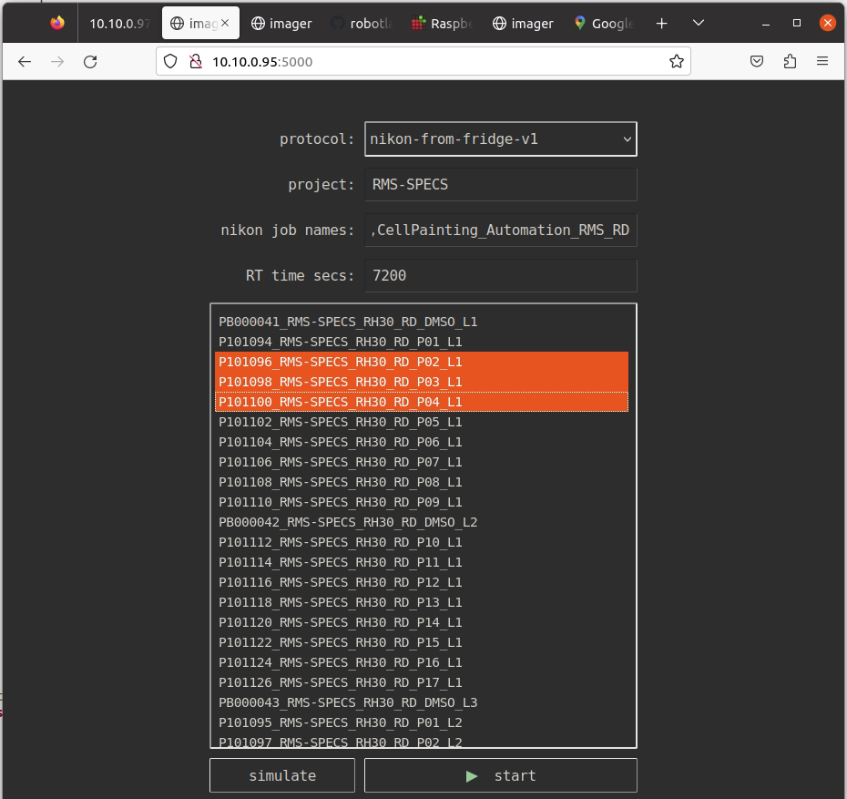
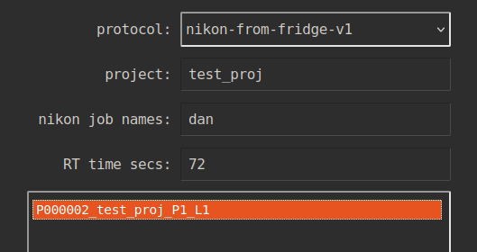
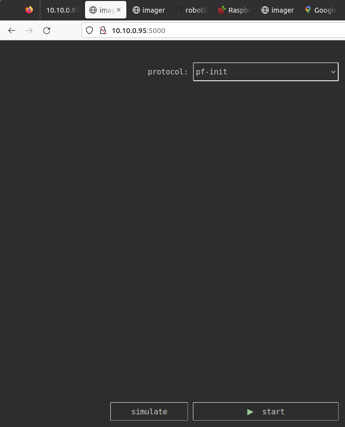
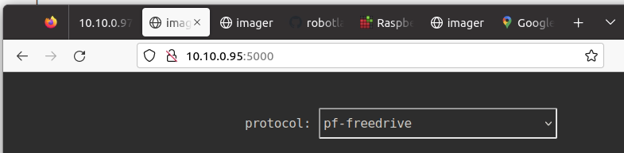
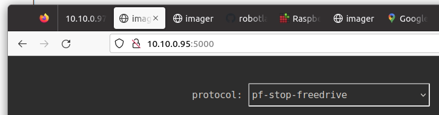
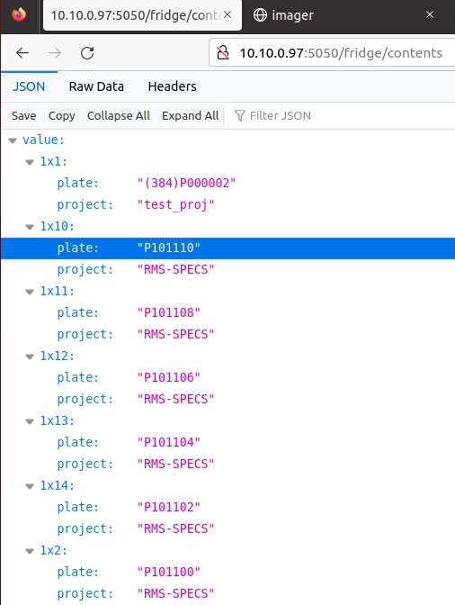

# imager standard operating protocol

Written for RMS-SPECS.

The imager gui is at http://10.10.0.95:5000
It can be reached from the Squid computer as well as the Nikon computer.
(technically it is running on the squid asus)

To run RMS-SPECS use gui and select the protocol `nikon-from-fridge-v1`.

Here are the settings for running the two protocols
back-to-back with a warm up time of 7200 secs (= 2 hours):

<table>
<tr><td>project:<td><tt>RMS-SPECS
<tr><td>nikon job names:<td><tt>CellPainting_Automation_RMS_RD,CellPainting_Automation_FA
<tr><td>RT time secs:<td><tt>7200
</table>

Select some plates. The selected plates will be imaged in the order they are in the list (from top to bottom):

Before starting:

* Make sure the following positions are free from plates:
1. fridge transfer station just in front of the barcode reader
2. H12, the top location of the hotel
3. the Nikon stage

* Locate the robotarm emergency stop button and put it where you can reach it
  - In doubt, stop the robot immediately using this button
  - Then press the stop button in the user interface

### Running a test

Use the test_proj plate. The Nikon job named `dan` can be used:

### Restarting from emergency stop

Rotate the emergency stop button so it releases.

Run the `pf-init` protocol. The robot gripper will open, very slowly, and then close again.

If it is holding a plate: be ready to catch it.

If it was holding a plate: run the pf-init once more without a plate, or it will be confused about how wide its grip is.

### Moving the robot around: robot freedrive

Robot must be initialized (and emergency stop button must be released.)

If it is holding a plate: be ready to catch it. The gripper is released when starting robot freedrive.

Run the `pf-freedrive` protocol. When you're done press the stop button in the gui, go back and run `pf-stop-freedrive`.

### Fridge contents

The contents of the fridge at http://10.10.0.97:5050/fridge/contents

