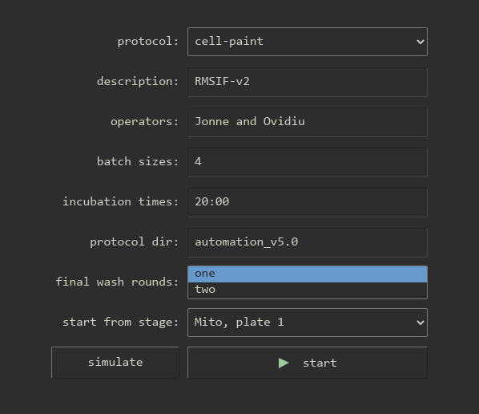

# Standard operating procedure for robot-cellpainter

For dry runs.

For actual cell painting the protocol is similar but preparation and post-work
for washer, dispenser and incubator are more involved.

## Access gui on http://10.10.0.55:5000

The gui (graphical user interface) runs on http://10.10.0.55:5000.

<details>
<summary>
    If it is unavailable these are the detailed instructions how to start it.
</summary>

The gui runs on the NUC running ubuntu which has hostname NUC-robotlab.

Log in as `pharmbio`, go to the directory for the repo, `~/robotlab/cellpainter`.

On the windows computer start PowerShell.

```
ssh pharmbio@10.10.0.55
```

The output should look like:

```
PS C:\Users\pharmbio> ssh pharmbio@10.10.0.55
pharmbio@10.10.0.55's password:
Welcome to Ubuntu 20.04.2 LTS (GNU/Linux 5.4.0-91-generic x86_64)

 * Documentation:  https://help.ubuntu.com
 * Management:     https://landscape.canonical.com
 * Support:        https://ubuntu.com/advantage

453 updates can be installed immediately.
308 of these updates are security updates.
To see these additional updates run: apt list --upgradable

Last login: Thu Jan 19 11:42:57 2023 from 10.10.0.10
pharmbio@NUC-robotlab:~$
```

Make sure the `robotlab` code you are running is the desired version.
Use `git status`, `git pull`, `git log`, etc.

Continue in this shell:

```
cd robotlab/cellpainter
cellpainter-gui --live
```

The output looks like:

```
pharmbio@NUC-robotlab:~/robotlab/cellpainter$ cellpainter-gui --live
Running with config.name='live'
 * Env(VIABLE_DEV=True, VIABLE_RUN=True, VIABLE_HOST=None, VIABLE_PORT=None)
 * Serving Flask app 'cellpainter.gui.main' (lazy loading)
 * Environment: production
   WARNING: This is a development server. Do not use it in a production deployment.
   Use a production WSGI server instead.
 * Debug mode: off
generating program... (0.154s)
```
</details>

## Incubator preparation

1. Turn on incubator.

## Washer preparation

1. Turn on washer.

2. Attach pump D. (For dry runs: attach water from the green tap.)

3. Attach the waste bottle.

## Dispenser preparation

1. Turn on dispenser.

2. Attach the casettes to the peristaltic pumps.

3. For dry runs: you may run with air (do nothing more) or with water for the green tap.

4. Attach a waste bottle. For dry runs: pick one used only with water and ethanol.

## Robot arm preparation

Use the teach pendant.

1. Power on the robotarm.

2. Move the robot arm to the neutral position (in front of the B21 hotel rack.)

   With the teach pendant, hold down the freedrive button on the back side.

3. Put the robot in remote mode.

4. Put the teach pendant close to the keyboard so you can reach the emergency button.

## Test communications

1. Use the windows computer and go to http://10.10.0.55:5000.

2. Run the test communications protocol, `test-comm` to verify that all machines can be communicated with.

   Common ways this can fail:

   * Robotarm might be in local mode. Change it to remote mode on the teach pendant.

   * Incubator communication might not be activated. Run the `incu-reset-and-activate` protocol.
     The incubator communication program STX Driver must be running. Run it on the windows computer.

   * If http://10.10.0.56:5050 cannot be reached make sure the
     windows computer is running the labrobots server:
     https://github.com/pharmbio/robotlab/tree/main/labrobots

## Run test circuit

1. Run the test circuit protocol, `test-circuit`, to see that everything is in the correct place.
   This is optional if you know everything is in order.

   Start with one plate with lid in the incubator transfer door.

   If moves fail: move the instruments to their correct locations.

   If that is not possible update the locations using the `cellpainter-moves` program.

## Loading the incubator

For dry runs: make sure the plates are decontaminated since they are going into the incubator.

1. Place the plates in A1, A2, A3, ... They will be moved to L1, L2, L3, ... inside the
   incubator. L1 is the first plate to be painted, L2 the second, and so on.

2. Make sure the robot is in neutral position (in front of the B21 hotel rack).

   Use the teach pendant and its freedrive button.

3. Use the windows computer and go to http://10.10.0.55:5000.

4. Use the load incubator protocol, `incu-load`, and enter the number of plates. Press start!

## Painting

1. Make sure the robot is in neutral position (in front of the B21 hotel rack)

   Use the teach pendant and its freedrive button.

2. Use the windows computer and go to http://10.10.0.55:5000.

3. Select the `cell-paint` protocol and enter the desired settings.

   

   The fields `description` and `operators` are informal. They are saved convenience and may be edited later.

   To run multiple batches in a row enter them with a comma: `6,6`. The second batch will start right after the first.

   If running with more than 9 plates you might need to increase the incubation time (depending on the protocol directory.)

   The protocol directory contains the protocol files for the washer and dispenser. These need to be named
   according to the schema in [protocol_paths.py](cellpainter/protocol_paths.py).

   For 7 and more plates use two final wash rounds.

   Starting from a later stage can be used to recover from failure.
   It can be used to skip parts, such as Mito. Note: the initial washer priming is not included if
   starting from a later stage, do this manually first.

   Press start or simulate.

## After painting: saving the log file

1. Use the windows computer and go to http://10.10.0.55:5000.

2. Go to the _show logs_ section.

3. Select the new log files, press add to git, then follow the pop-ups.

## After painting: rewinding the lab

1. Return the robot to local mode.

2. For dry run: Empty the washer tubings by priming them.

3. For dry run: Detach the washer waste bottle and dispose it if it is only water.

4. For dry run: if dispenser was run with water then empty tubings by priming them and dispose the waste water.

5. Detach the dispenser cassettes around the peristaltic pumps.

6. Incubator:

   - For dry runs when the incubator is not set up for experiments: turn
     off and have it slightly open for a while to let it cool down.

   - When the incubator is set up for experiment: ask Polina. The proceduce
     will include removing the water with a suction pump.

## Configure BioTek protocols and add time estimates for them

1. Make a new directory in the protocols root on the windows computer. You could copy an existing one, `automation_v5.0/` should be a good start.

2. Modify the LHC files as you please and give their names prefixes according to the
   documentation of `ProtocolPaths` and `template_protocol_paths` in
   [`cellpainter/protocol_paths.py`](cellpainter/protocol_paths.py).

3. Put one plate without lid in the washer and connect it to water. Run
   the dispenser on air, a plate is optional. Using liquids and a plate will
   not work, the plate will overflow.

4. Use the windows computer and go to http://10.10.0.55:5000.

5. Select `time-bioteks` and enter the protocol directory name. Start!

6. Afterwards, go back to the main menu and go to _show logs_. Toggle _show all_ and then select the new log files.
    Press _add timings_.

The remaining steps save the timings to version control. They are not strictly
required to start using the protocol directory.

1. Use `pharmbio@NUC-robotlab` in the directory for the repo, `~/robot-cellpainter/`.

2. Use `git status` and `git diff` to see that `estimates.json` and
   `protocol_paths.json` are correctly updated.

3. Commit and push the changes:

   ```
   git add estimates.json protocol_paths.json
   git commit -m 'Add time estimates for a new protocol directory'
   git push
   ```

## Update robotarm timings

1. Run a protocol including the moves you need.

2. Afterwards, go back to the main menu and go to _show logs_. Toggle _show all_ and then select the new log files.
   Press _add timings_.

The remaining steps save the timings to version control. They are not strictly
required to start using the protocol directory.

1. Use `pharmbio@NUC-robotlab` in the directory for the repo, `~/robot-cellpainter/`.

2. Use `git status` and `git diff` to see that `estimates.json` is correctly updated.

3. Commit and push the changes:

   ```
   git add estimates.json protocol_paths.json
   git commit -m 'Add new robotarm timings'
   git push
   ```

## Test plate decontamination

The purpose of this step is to make the test plates safe and clean to be used inside the incubator.
If they have any dirt the incubator quickly gets contaminated. If the clean plate are
touched by hand without gloves they are not considered clean any more and must not enter the incubator.

1. Put test plates in Virkon for a few hours

2. Prepare for --wash-plates-clean:

2.1 Put plates in A1, A3, ...

2.2 Attach washer pump D to water from green tap

2.3 Attach washer pump C to ethanol

2.4 Attach washer waste bottle, preferably an empty one or one just used with water and ethanol

3. Use the gui on the windows computer at http://10.10.0.55:5000, select `wash-plates-clean` and enter the number of plates. Press start!

    <details>
    <summary>Alternative: use the command line</summary>

    Use `pharmbio@NUC-robotlab` in the directory for the repo, `~/robot-cellpainter/`.

    ```
    cellpainter --wash-plates-clean --num-plates $NUM_PLATES --live
    ```
    </summary>

4. After wash-plates-clean:

4.1 Prime the washer tubes empty

4.2 Detach the washer waste bottle. If it contains only water and ethanol: empty it in the sink

4.3 Your plates are now safe! Safe plates may enter the incubator. They must not be touched without gloves.

