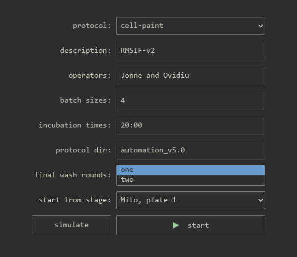
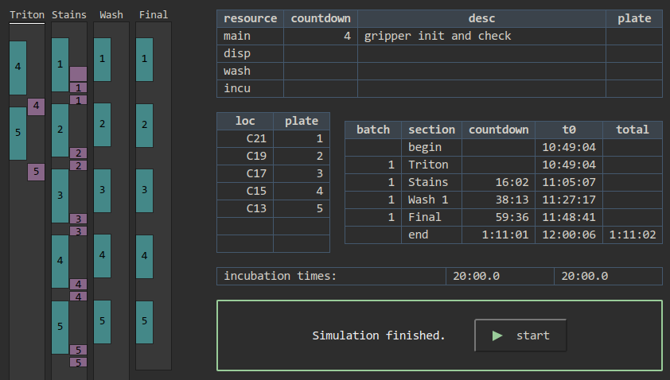

# Standard operating procedure for robot cellpainter

Standard operating procedure for robot cellpainter.

## Access gui on <a href="http://10.10.0.55:5000" target=_blank>http://10.10.0.55:5000</a>

From the windows computer use <a href="http://10.10.0.55:5000" target=_blank>http://10.10.0.55:5000</a>.
From other computers on the network use <a href="http://10.10.0.55:5000" target=_blank>http://10.10.0.55:5000</a>.

This can fail if the windows nuc has been the restarted and the labrobots server is not running.
Check if <a href="http://10.10.0.56:5050" target=_blank>http://10.10.0.56:5050</a> can be reached.
If not, run labrobots on the windows computer.
The icon looks like this and it starts a terminal with this kind of output.
Minimize the terminal and keep it running.


<details>
<summary>
If still unavailable the process on the ubuntu nuc might be down if that computer has been restarted.
Here are detailed instructions how to start it (for system administrators).
</summary>

The gui runs on the NUC running ubuntu which has hostname NUC-robotlab.

It runs in a screen named `painter` in the `~/painter-robotlab` checkout of the repo.

```
ssh pharmbio@10.10.0.55
screen -x painter
```

If the screen is not running, start it with:

```
ssh pharmbio@10.10.0.55
pharmbio@NUC-robotlab:~$ screen -S painter
pharmbio@NUC-robotlab:~$ cd painter-robotlab/
pharmbio@NUC-robotlab:~/painter-robotlab$ source painter-venv/bin/activate
(painter-venv) pharmbio@NUC-robotlab:~/painter-robotlab$ cd cellpainter/
(painter-venv) pharmbio@NUC-robotlab:~/painter-robotlab/cellpainter$ cellpainter-gui --live
Running with config.name='live'
 * Env(VIABLE_DEV=True, VIABLE_RUN=True, VIABLE_HOST=None, VIABLE_PORT=None)
 * Serving Flask app 'cellpainter.gui.main'
 * Debug mode: off
```

</details>

## Incubator preparation

1. Turn on incubator.

## Washer preparation

1. Turn on washer.

2. Attach pump D. (For dry runs: attach water from the green tap.)

3. Attach the waste bottle.

## Dispenser preparation

1. Turn on dispenser.

2. Attach the casettes to the peristaltic pumps.

3. For dry runs: you may run with air (do nothing more) or with water for the green tap.

4. Attach a waste bottle. For dry runs: pick one used only with water and ethanol.

## Robot arm preparation

Use the teach pendant (the handheld touchpad tablet).

1. Power on the robotarm.

2. Move the robot arm to the neutral position (in front of the B21 hotel rack.)

   With the teach pendant, hold down the freedrive button on the back side.

3. Put the robot in remote mode (upper-right corner).

4. Put the teach pendant close to the keyboard so you can reach the emergency button.

## Test communications

1. Use the windows computer and go to the gui at http://10.10.0.55:5000.

2. Run the test communications protocol, `test-comm` to verify that all machines can be communicated with.

   Common ways this can fail:

   * Robotarm might be in local mode. Change it to remote mode on the teach pendant.

   * The incubator communication program STX Driver must be running. Run it on the windows computer.
     The icon and the program looks like this. Press the Run button. Minimize the program and keep it running.

     

   * Incubator communication might not be activated. Run the `incu-reset-and-activate` protocol.

## Run test circuit

1. Run the test circuit protocol, `test-circuit`, to see that everything is in the correct place.
   This is optional if you know everything is in order.

   Start with one plate with lid in the incubator transfer door.

   If moves fail: move the instruments to their correct locations.

   If that is not possible ask Dan to update the locations under _More: edit moves_.

## Loading the incubator

For dry runs: make sure the plates are decontaminated since they are going into the incubator.

1. Place the plates in A1, A2, A3, ... They will be moved to L1, L2, L3, ... inside the
   incubator. L1 is the first plate to be painted, L2 the second, and so on.

2. Make sure the robot is in neutral position (in front of the B21 hotel rack).

   Use the teach pendant and its freedrive button.

3. Use the windows computer and go to the gui at http://10.10.0.55:5000.

4. Use the load incubator protocol, `incu-load`, and enter the number of plates. Press start!

## Painting

1. Make sure the robot is in neutral position (in front of the B21 hotel rack)

   Use the teach pendant and its freedrive button.

2. Use the windows computer and go to the gui at http://10.10.0.55:5000.

3. Select the `cell-paint` protocol and enter the desired settings.

   

   The fields `description` and `operators` are informal. They are saved convenience and may be edited later.

   To run multiple batches in a row enter them with a comma: `6,6`. The second batch will start right after the first.

   If running with more than 9 plates you might need to increase the incubation time (depending on the protocol directory.)

   The protocol directory contains the protocol files for the washer and dispenser. These need to be named
   according to the schema in [protocol_paths.py](cellpainter/protocol_paths.py).

   For 7 and more plates use two final wash rounds. Protocols with the bluewasher always use only one final wash round.
   hThere is no choice.

   Press start or press simulate.

   ### Recovering from a crash

   Use `start from stage` to recover from a crash. Start from the stage you want to continue from.
   Press simulate and rewind the time to the start to see what the locations of every plate should be when starting.

   If a plate needs some extra dispense or wash step run these before starting the robotarm again.

   If a plate has been damaged and cannot be used further in the experiment, decrease the number
   of plates under `batch sizes`. This will make the starting positions change so simulate and check what the
   starting locations are.

   **An example.** Consider this batch of 6 plates where plate 4 is damaged during the Triton step. Plates 1, 2 and 3 have had
   their Triton applied. Plate 5 and 6 have not yet had their Triton. An illustration:

   <table>
   <td align=center valign=top width=100px>plate 1
   <td align=center valign=top width=100px>plate 2
   <td align=center valign=top width=100px>plate 3
   <td align=center valign=top width=100px><del><strike>plate 4
   <td align=center valign=top width=100px>plate 5
   <td align=center valign=top width=100px>plate 6
   </table>

   Remove plate 4. The batch size is now 5. The batch looks like this:

   <table>
   <tr>
   <td align=center valign=top width=100px>plate 1
   <td align=center valign=top width=100px>plate 2
   <td align=center valign=top width=100px>plate 3
   <td align=center valign=top width=100px>plate 4<br><i>(previously plate 5)
   <td align=center valign=top width=100px>plate 5<br><i>(previously plate 6)
   </table>

   Change the batch size to 5 and start from the stage `Triton, plate 4`. The robot will start with the plate _now_ called 4, which _previously_ was plate 5.

   In simulation, with time set to the beginning, the initial locations can be read off from the `loc-plate` table. Place the plates correctly
   before restarting the robot. This is a screenshot of the simulation:

   

## After painting: saving the log file

1. Use the windows computer and go to the gui at http://10.10.0.55:5000.

2. Go to the _show logs_ section.

3. Check the boxes for the new log files, press _add to git_ and follow the pop-ups.

## After painting: rewinding the lab

1. For dry run: Prime the washer tubes to empty them.

2. For dry run: Detach the washer waste bottle. If it is only water: dispose it.

3. For dry run: If dispenser was run with water: Prime to empty tubes and dispose the waste water.

4. Detach the dispenser cassettes around the peristaltic pumps.

5. Incubator:

   - For dry runs when the incubator is not set up for experiments: turn
     off and have it slightly open for a while to let it cool down.

   - When the incubator is set up for experiment: ask Polina. The procedure
     will include removing the water with a suction pump.

## Configure BioTek and blue washer protocols and add time estimates for them

1. Make a new directory in the protocols root on the windows computer.
   You could copy an existing one, `automation_v5.0/` might be a good start.

2. Modify the LHC files as you please and give their names prefixes according to the
   documentation of `ProtocolPaths` and `template_protocol_paths` in
   [`cellpainter/protocol_paths.py`](cellpainter/protocol_paths.py).

3. Put one plate without lid in the washer and connect it to water. Run
   the dispenser on air, a plate is optional. Using liquids and a plate will
   not work, the plate will overflow.

4. Use the windows computer and go to the gui at http://10.10.0.55:5000.

5. Select `time-protocols` and enter the protocol directory name. Start!

6. After success, press _store timings_.


<details>
<summary>
The remaining steps save the timings to version control. They are not strictly
required to start using the protocol directory.
</summary>

1. Use `pharmbio@NUC-robotlab` in the directory for the repo, `~/painter-robotlab/`.

2. Use `git status` and `git diff` to see that `cellpainter/estimates.json` and
   `cellpainter/protocol_paths.json` are correctly updated.

3. Commit and push the changes:

   ```
   git add cellpainter/estimates.json cellpainter/protocol_paths.json
   git commit -m 'Add time estimates for a new protocol directory'
   git push
   ```
</details>

## Update robotarm timings

1. Run a protocol containing the missing moves.

2. After success, press _store timings_.

## Test plate decontamination

The purpose of this step is to make the test plates safe and clean to be used inside the incubator.
If they have any dirt the incubator quickly gets contaminated. If the clean plate are
touched by hand without gloves they are not considered clean any more and must not enter the incubator.

1. Put test plates in Virkon for a few hours

2. Prepare for --wash-plates-clean:

    2.1 Put plates in A1, A2, ....

    2.2 Attach washer pump D to water from green tap.

    2.3 Attach washer pump C to ethanol.

    2.4 Attach washer waste bottle, preferably an empty one or one just used with water and ethanol.

4. Use the windows computer and go to the gui at http://10.10.0.55:5000.

5. Select `wash-plates-clean` and enter the number of plates. Press start!

6. After wash-plates-clean:

    4.1 Prime the washer tubes empty.

    4.2 Detach the washer waste bottle. If it contains only water and ethanol: empty it in the sink.

    4.3 Your plates are now safe! Safe plates may enter the incubator. They must not be touched without gloves.

