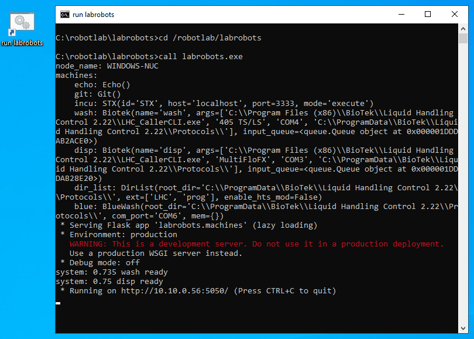
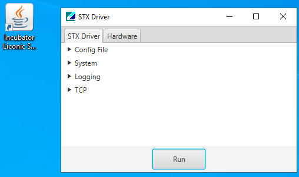
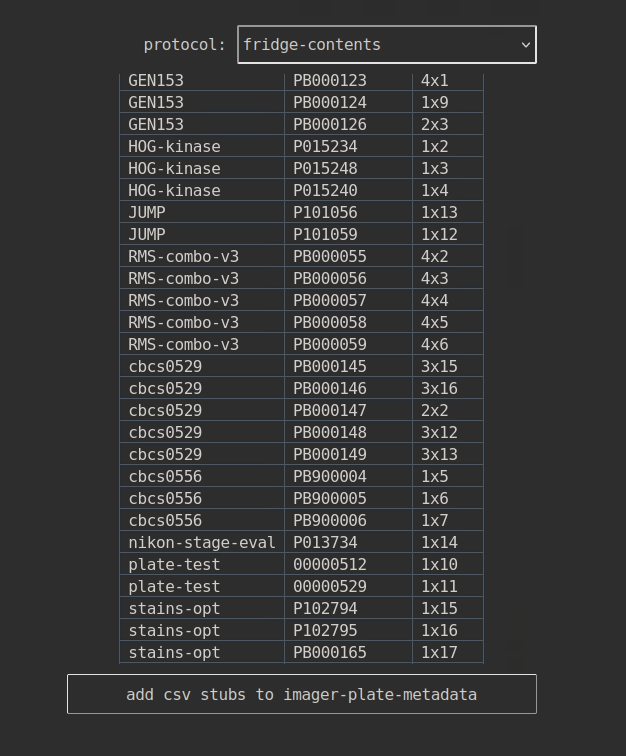
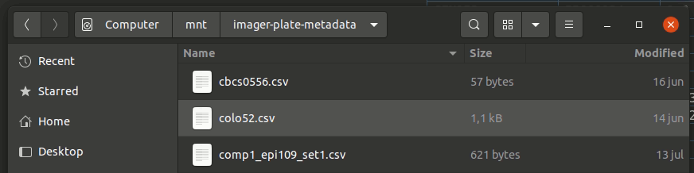
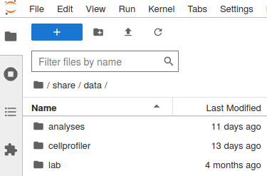
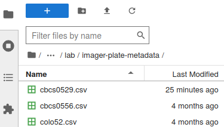
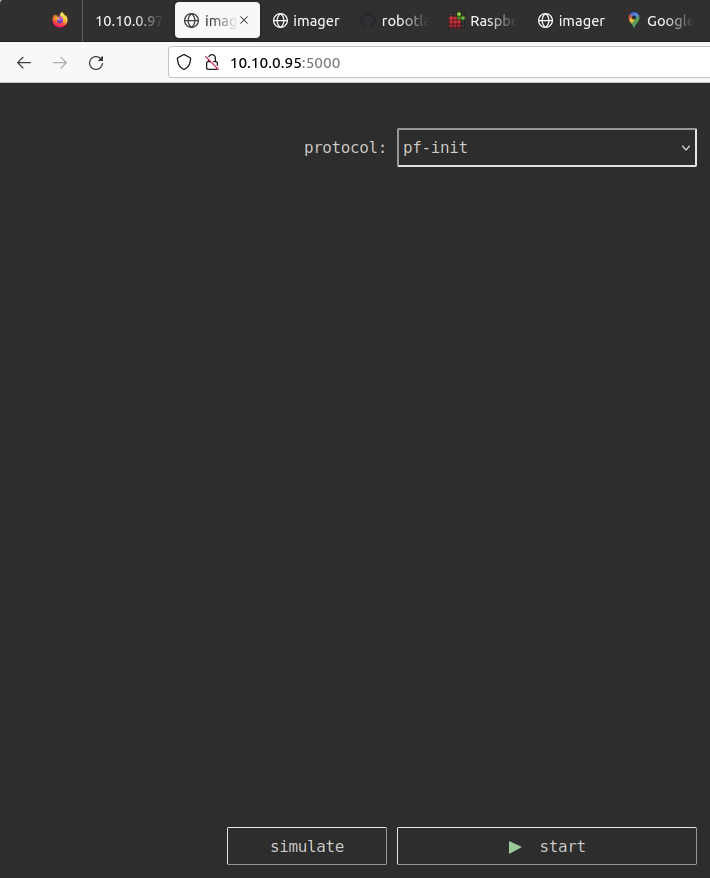
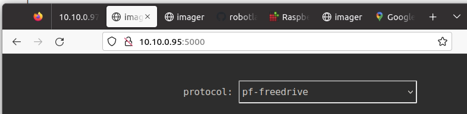
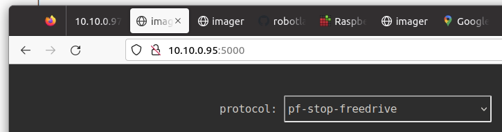

# Robot Imager Standard Operating Procedure

## Accessing the GUI <a href="http://imager:3000" target=_blank>http://imager:3000</a>

- **Squid computer**: <a href="http://imager:3000" target=_blank>http://imager:3000</a>.
- **Other network computers (e.g. Nikon)**: <a href="http://10.10.0.55:3000" target=_blank>http://10.10.0.55:3000</a>.

<details>
<summary>
GUI Web Page Unavailable?
</summary>

This might indicate the web server is down. Below are instructions to restart it (for system administrators):

The gui runs on the ubuntu NUC in the painter lab with hostname NUC-robotlab.

It runs in a screen named `imager` in the `~/imager-robotlab` checkout of the repo.

```
ssh pharmbio@10.10.0.55
screen -x imager
```

If the screen is not running, start it with:

```
ssh pharmbio@10.10.0.55
pharmbio@NUC-robotlab:~$ screen -S imager
pharmbio@NUC-robotlab:~$ cd imager-robotlab/
pharmbio@NUC-robotlab:~/imager-robotlab$ source imager-venv/bin/activate
(imager-venv) pharmbio@NUC-robotlab:~/imager-robotlab$ cd cellpainter/
(imager-venv) pharmbio@NUC-robotlab:~/imager-robotlab/cellpainter$ VIABLE_PORT=3000 cellpainter-gui --live
Running with config.name='live'
 * Env(VIABLE_DEV=True, VIABLE_RUN=True, VIABLE_HOST=None, VIABLE_PORT=3000)
 * Serving Flask app 'cellpainter.gui.main'
 * Debug mode: off
```

Note that you need to set the variable `VIABLE_PORT=3000` to start it.

</details>

<details>
<summary>
Troubles with the fridge, barcode reader or "windows gbg" computer?
</summary>
The "windows gbg" computer operates the fridge and barcode reader.
If you suspect they are down, check if <a href="http://10.10.0.97:5050" target=_blank>http://10.10.0.97:5050</a> can be reached.
Here are detailed instructions to restart it.

Connect to the window gbg computer via any desk (for example using the squid computer).

Look for the run labrobots icon, it like this and it starts a terminal with this kind of output.
Minimize the terminal and keep it running.



The incubator communication program STX Driver must be running. Run it on the windows computer.
The icon and the program looks like this. Press the Run button. Minimize the program and keep it running.


</details>

## Start the squid software with enabled remote control

The squid software needs to be started with a web service for remote control.
Start it with this shortcut on the desktop:


The web service remote control is running if this page returns:
<a href="http://10.10.0.95:5050/squid/status" target=_blank>http://10.10.0.95:5050/squid/status</a>.

<details>
<summary>Desktop Shortcut Missing?</summary>
If the shortcut on the desktop is missing, these are the instructions how to start it from the terminal.

Start a terminal on the squid computer and issue these commands:

```
cd ~/Downloads/squid/software/
squid_web_service=10.10.0.95:5050 python3 main_hcs.py
```

The terminal window will have this kind of text now, and the gui window should have started:

```
pharmbio@mikro-asus:~$ cd ~/Downloads/squid/software/
pharmbio@mikro-asus:~/Downloads/squid/software$ squid_web_service=10.10.0.95:5050 python3 main_hcs.py
LOG 2023-06-16_14.30.06.492280 : startup - connecting to controller based on Teensy
LOG 2023-06-16_14.30.06.697830 : startup - controller connected
LOG 2023-06-16_14.30.06.698729 : startup - reset the microcontroller
LOG 2023-06-16_14.30.06.699056 : startup - initialized the drivers
LOG 2023-06-16_14.30.09.001699 : homing - objective retracted
LOG 2023-06-16_14.30.12.323501 : homing - in loading position
LOG 2023-06-16_14.30.14.143246 : homing - left loading position
LOG 2023-06-16_14.30.15.381152 : homing - objective raised
 * Serving Flask app 'control.web_service'
 * Debug mode: off
WARNING: This is a development server. Do not use it in a production deployment. Use a production WSGI server instead.
 * Running on http://10.10.0.95:5050
Press CTRL+C to quit
```
</details>

## Fridge loading

Use `fridge-load-from-hotel` and provide a project name and plate count.
The system begins loading from H11 and downwards to H1, and then upwards from H13 and to H19.

Plates should be without lids. Never use lids with the imager system.

The project name will be used as project name in the acquired images and consequently also in the image database.

The barcode scanner identifies each plate. If a scan fails, revert to fridge-put and input the barcode manually.
You can wiggle it around the barcode reader to make it show up in the user interface.

Before starting:

* Make sure the fridge transfer station just in front of the barcode reader is empty.

* Locate the robotarm emergency stop button and put it where you can reach it.
  - In doubt, stop the robot immediately using this button
  - Then press the stop button in the user interface

## Fridge unloading

Use `fridge-unload` and select up to 18 plates.

Before starting:

* Make sure the following positions are free from plates and obstacles:
1. fridge transfer station just in front of the barcode reader
2. the hotel
3. the area marked with white tape on the table in front of the hotel

* Locate the robotarm emergency stop button and put it where you can reach it.
  - In doubt, stop the robot immediately using this button
  - Then press the stop button in the user interface

## Imaging with squid

Use `squid-acquire-from-fridge`. Specify a project in the auto-complete box, choose a protocol and RT time and the plates to image.
The selected images will be imaged in the order they appear in the select box. The order they appear in the select box can be
altered by rearranging the lines in the imager-plate-metadata csv files.

Before starting:

* Make sure the following positions are free from plates:
1. fridge transfer station just in front of the barcode reader
2. H11, the "neutral middle" location of the hotel
3. the squid stage

* Locate the robotarm emergency stop button and put it where you can reach it.
  - In doubt, stop the robot immediately using this button
  - Then press the stop button in the user interface

The system does not have estimates for how long the acquisition will take which can make
the gui visualisation look weird. All is still OK: the robotarm system will still do run
the machines in the same sequential order.

### Remote operations for a single plate

If you just want a plate to the squid to work with it, you can use `fridge-unload` and then `H11-to-squid`. You can now work
with the plate in the squid user interface. Put it back with `squid-to-H11` and then `fridge-load-from-hotel`.

## Plate metadata csv files

Metadata csv files serve to:

* add metadata about the plates to identify them beyond barcode, like cell line, replicate and layout,
* select microscope protocol when you need to more than one protocol,
* specify the order of acqusition.

Creating the csv files and adding plate metadata is optional.
Plates in the fridge without metadata can be acquired.

To ease making the csv files you can request the gui to create stub metadata csv files
from plates in the fridge.

Use `fridge-contents`, and press the button `add csv stubs to imager-plate-metadata`:



This will create metadata csv stub files to a network file share directory.
It is mounted on the squid computer as `/mnt/imager-plate-metadata`:



You can also access the csv metadata file from the notebooks under `/share/data/lab/imager-plate-metadata`:




The columns are `project`, `barcode`, `metadata`, `protocol`. The fourth column to specify per-plate microscope settings.
Lines about other projects than the filename of the csv file will be taken as comments and silent ignored:
make sure the project name matches the csv filename.

### Specifying the acquisition order

You can use the csv file to change the acquisition order, by rearranging the lines.
Example: you have just created this stub file from project `hog` with four plates:

```
hog,PB0101,
hog,PB0102,
hog,PB0103,
hog,PB0104,
```

You want to image in the order 1, 3, 2, 4. Arrange accordingly, and save:

```
hog,PB0101,
hog,PB0103,
hog,PB0102,
hog,PB0104,
```

### Adding plate metadata

Example: you have just created this stub file from project `hog` with four plates:

```
hog,PB0101,
hog,PB0102,
hog,PB0103,
hog,PB0104,
```

You want to add the layout and replicate info. Modify the file, and save:

```
hog,PB0101,P1_L1
hog,PB0102,P1_L2
hog,PB0103,P2_L1
hog,PB0104,P2_L2
```

The allowed project and metadata characters are English lower and upper case letters, digits, underscore and minus.

The folder structure is based on the project, barcode and its metadata:

```
{project}/{barcode}_{project}_{metadata}
```

In this example the directories will be:

```
hog/PB0101_hog_P1_L1
hog/PB0102_hog_P1_L2
hog/PB0103_hog_P2_L1
hog/PB0104_hog_P2_L2
```

### Specifying per-plate squid protocols

Add squid protocol path as a fourth column to the csv file.

Example: you have just created this stub file from project `hog` with four plates:

```
hog,PB0101,
hog,PB0102,
hog,PB0103,
hog,PB0104,
```

You want to add the layout and replicate info as metadata and protocol as a fourth column. Modify the file, and save:

```
hog,PB0101,P1_L1,protocols/HOG_L1.json
hog,PB0102,P1_L2,protocols/HOG_L2.json
hog,PB0103,P2_L1,protocols/HOG_L1.json
hog,PB0104,P2_L2,protocols/HOG_L2.json
```

For acquisition, use `squid-acquire-from-fridge`. Custom protocols listed will override the dropdown protocol choice.

### Acquiring the same plate multiple times

You can use the csv file to acquire the same plate multiple times with different protocols.

Example: you have just created this stub file from project `hog` with four plates:

```
hog,PB0101,
hog,PB0102,
hog,PB0103,
hog,PB0104,
```

You want to image the first plate with two different protocols. List it twice, with the protocols you need:

```
hog,PB0101,P1_L1_short_exposure,protocols/HOG_L1_short_exposure.json
hog,PB0101,P1_L1_long_exposure,protocols/HOG_L1_long_exposure.json
hog,PB0102
hog,PB0103
hog,PB0104
```

The plate will stay in the microscope for all its consecutive acquisitions.

## Restarting from emergency stop

Rotate the emergency stop button so it releases.

Run the `pf-init` protocol. The robot gripper will open, very slowly, and then close again.

If it is holding a plate: be ready to catch it.

If it was holding a plate: run the pf-init once more without a plate, or it will be confused about how wide its grip is.



## Moving the robot around: robot freedrive

The robotarm must be initialized (and emergency stop button must be released.)

If it is holding a plate: be ready to catch it. The gripper is released when starting robot freedrive.

Run the `pf-freedrive` protocol. When you're done press the stop button in the gui, go back and run `pf-stop-freedrive`.





