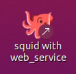

# Standard operating procedure for robot imager

Standard operating procedure for robot imager.

## Access gui on <a href="http://imager:3000" target=_blank>http://imager:3000</a>

From the windows computer use <a href="http://imager:3000" target=_blank>http://imager:3000</a>.
From other computers on the network use <a href="http://10.10.0.55:3000" target=_blank>http://10.10.0.55:3000</a>.
Technically it is running on the ubuntu NUC in the painter room.

<details>
<summary>
This can fail if the windows gbg has been the restarted and its labrobots server is not running.
Check if <a href="http://10.10.0.97:5050" target=_blank>http://10.10.0.97:5050</a> can be reached.
Here are detailed instructions how to restart it.
</summary>

Connect to the window gbg computer via any desk (on the squid computer).

Look for the run labrobots icon, it like this and it starts a terminal with this kind of output.
Minimize the terminal and keep it running.


The incubator communication program STX Driver must be running. Run it on the windows computer.
The icon and the program looks like this. Press the Run button. Minimize the program and keep it running.


</details>

<details>
<summary>
If still unavailable the process on the ubuntu nuc might be down if that computer has been restarted.
Here are detailed instructions how to start it (for system administrators).
</summary>

The gui runs on the NUC running ubuntu which has hostname NUC-robotlab.

It runs in a screen named `imager` in the `~/imager-robotlab` checkout of the repo.

```
ssh pharmbio@10.10.0.55
screen -x imager
```

If the screen is not running, start it with:

```
ssh pharmbio@10.10.0.55
pharmbio@NUC-robotlab:~$ screen -S imager
pharmbio@NUC-robotlab:~$ cd imager-robotlab/
pharmbio@NUC-robotlab:~/imager-robotlab$ source imager-venv/bin/activate
(imager-venv) pharmbio@NUC-robotlab:~/imager-robotlab$ cd cellpainter/
(imager-venv) pharmbio@NUC-robotlab:~/imager-robotlab/cellpainter$ VIABLE_PORT=3000 cellpainter-gui --live
Running with config.name='live'
 * Env(VIABLE_DEV=True, VIABLE_RUN=True, VIABLE_HOST=None, VIABLE_PORT=None)
 * Serving Flask app 'cellpainter.gui.main'
 * Debug mode: off
```

Note that you need to set the variable `VIABLE_PORT=3000` to start it.

</details>

## Start the squid software with enabled remote control

The squid software needs to be started with a web service for remote control.
Start it with this shortcut on the desktop:



The web service remote control is running if this page returns:
<a href="http://10.10.0.95:5050/squid/status" target=_blank>http://10.10.0.95:5050/squid/status</a>.

<details>
<summary>
If the shortcut on the desktop is missing, these are the instructions how to start it from the terminal.
</summary>
Start a terminal on the squid computer and issue these commands:

```
cd ~/Downloads/squid/software/
squid_web_service=10.10.0.95:5050 python3 main_hcs.py
```

The terminal window will have this kind of text now, and the gui window should have started:

```
pharmbio@mikro-asus:~$ cd ~/Downloads/squid/software/
pharmbio@mikro-asus:~/Downloads/squid/software$ squid_web_service=10.10.0.95:5050 python3 main_hcs.py
LOG 2023-06-16_14.30.06.492280 : startup - connecting to controller based on Teensy
LOG 2023-06-16_14.30.06.697830 : startup - controller connected
LOG 2023-06-16_14.30.06.698729 : startup - reset the microcontroller
LOG 2023-06-16_14.30.06.699056 : startup - initialized the drivers
LOG 2023-06-16_14.30.09.001699 : homing - objective retracted
LOG 2023-06-16_14.30.12.323501 : homing - in loading position
LOG 2023-06-16_14.30.14.143246 : homing - left loading position
LOG 2023-06-16_14.30.15.381152 : homing - objective raised
 * Serving Flask app 'control.web_service'
 * Debug mode: off
WARNING: This is a development server. Do not use it in a production deployment. Use a production WSGI server instead.
 * Running on http://10.10.0.95:5050
Press CTRL+C to quit
```
</details>

## Loading the fridge

Use `fridge-load-from-hotel`. Specify a project name and the number of plates.
The project name will be used as project name in the acquired images and consequently also  in the image database.
The barcode scanner will be used.

Plates should be without lids. Never use lids with the imager system.

If it fails run `fridge-put` and enter the barcode manually. You can wiggle
it around the barcode reader to make it show up in the user interface.

Before starting:

* Make sure the fridge transfer station just in front of the barcode reader is empty.

* Locate the robotarm emergency stop button and put it where you can reach it.
  - In doubt, stop the robot immediately using this button
  - Then press the stop button in the user interface

## Unloading the fridge

To unload the fridge use `fridge-unload` and pick up to 12 plates from the select box.

Before starting:

* Make sure the following positions are free from plates and obstacles:
1. fridge transfer station just in front of the barcode reader
2. the hotel
3. the area marked with white tape on the table in front of the hotel

* Locate the robotarm emergency stop button and put it where you can reach it.
  - In doubt, stop the robot immediately using this button
  - Then press the stop button in the user interface

## Listing fridge contents and supplying plate metadata

Use `fridge-contents`.

You can use `add csv stubs to imager-plate-metadata` to add to the network file share (nfs) directory.
It is mounted on the squid computer as `/mnt/imager-plate-metadata`.

Example: you just loaded two plates to the YM project. Press the `add csv stubs...` button and the `YM.csv`
file will be created with the following contents:

```
YM,PB900002,
YM,PB900003,
```

You can now add metadata by editing the file and saving it:

```
YM,PB900002,L1
YM,PB900003,L2
```

The columns are `project`, `barcode`, `metadata`. We will later use a fourth column to specify per-plate microscope settings.
Lines about other projects than the filename of the csv file will be taken as comments and silent ignored:
make sure the project name matches the csv filename.

Creating lines in the csv files and adding plate metadata is optional. Plates in the fridge without metadata can be acquired.

## Acquire using squid

Use `squid-acquire-from-fridge`. Specify a project in the auto-complete box, choose a protocol and RT time and the plates to image.
The selected images will be imaged in the order they appear in the select box. The order they appear in the select box can be
altered by rearranging the lines in the imager-plate-metadata csv files.

Before starting:

* Make sure the following positions are free from plates:
1. fridge transfer station just in front of the barcode reader
2. H12, the top location of the hotel
3. the squid stage

* Locate the robotarm emergency stop button and put it where you can reach it.
  - In doubt, stop the robot immediately using this button
  - Then press the stop button in the user interface

The system does not have estimates for how long the acquisition will take which can make
the gui visualisation look weird. All is still OK: the robotarm system will still do run
the machines in the same sequential order.

### Working remotely with one plate

If you just want a plate to the squid to work with it, you can use `fridge-unload` and then `H12-to-squid`. You can now work
with the plate in the squid user interface. Put it back with `squid-to-H12` and then `fridge-load-from-hotel`.

## Specifying per-plate squid settings

Add squid protocol path as a fourth column to the csv file. On the YM example, edit the YM.csv file and add:

```
YM,PB900002,L1,protocols/YM_L1.json
YM,PB900003,L2,protocols/YM_L2.json
```

Now you can use squid-acquire-from-fridge and the protocols for the lines will override whatever value is in the squid protocol dropdown.
If you have custom protocol paths for all plates it does not matter what protocol you pick in the dropdown. Its setting will not be used for any plate.

### Specifying the order of acquisitions

You can use the csv file to change the acquisition order.

In the YM example, to image L2 before L1, put its line first in the csv:

```
YM,PB900003,L2
YM,PB900002,L1
```

### Acquiring the same plate multiple times

You can use the csv file to acquire the same plate multiple times with different protocols.

In the YM example, to image L1 with two different protocols, put the same plate on two lines:

```
YM,PB900002,L1_U2OS,protocols/YM_U2OS.json
YM,PB900002,L1_MCF7,protocols/YM_MCF7.json
```

Note: the software will make the unnecessary roundtrip to the fridge in between.
Contact Dan when you plan to use this feature so he can prioritize it.

## Restarting from emergency stop

Rotate the emergency stop button so it releases.

Run the `pf-init` protocol. The robot gripper will open, very slowly, and then close again.

If it is holding a plate: be ready to catch it.

If it was holding a plate: run the pf-init once more without a plate, or it will be confused about how wide its grip is.


## Moving the robot around: robot freedrive

The robotarm must be initialized (and emergency stop button must be released.)

If it is holding a plate: be ready to catch it. The gripper is released when starting robot freedrive.

Run the `pf-freedrive` protocol. When you're done press the stop button in the gui, go back and run `pf-stop-freedrive`.


